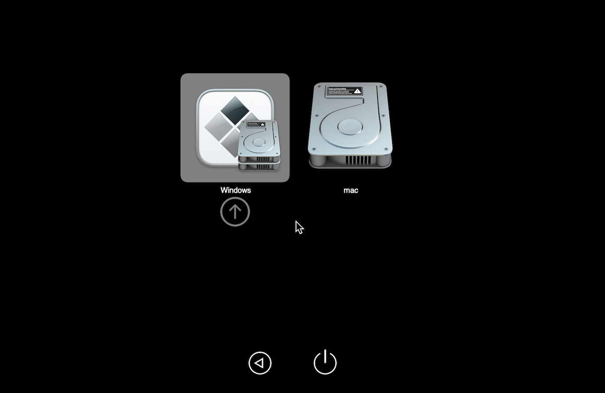
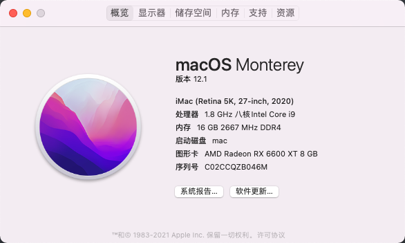
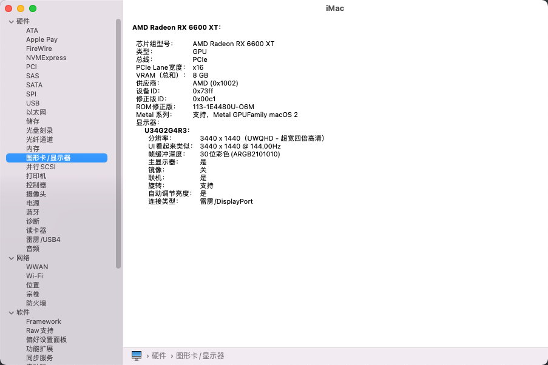
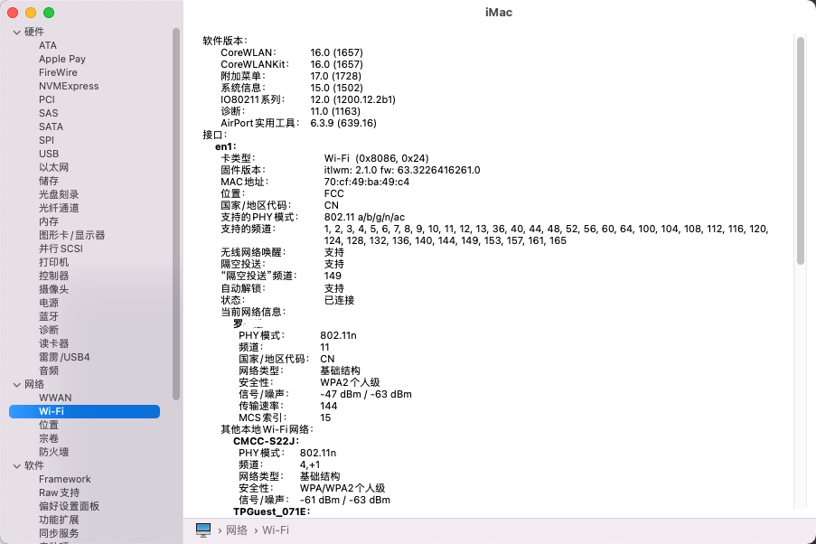

主板：MAG B560M MORTAR WIFI

CPU: intel i9 11900k

GPU: 蓝宝石 6600xt 超白金

板载网卡：Realtek® 8125B 2.5G LAN

WIFI & BLUETOOTH： Intel® Wi-Fi 6E AX210

EFI地址：https://github.com/luoxh8/MSI_B560m_Wifi_i9_11900k_6600xt

相同配置的朋友， 可以拿去直接用。

以下功能，在macOS 12.1测试无问题（低于此版本的macOS自行测试，部分kext需要修改）：

- 6600xt可以正常驱动识别（开机会出现3s黑屏，正常情况），支持HDR，本人AOC 34英寸 21:9， 使用无问题。
- 待机睡眠后，主板/显卡/水冷，灯光自动关闭。唤醒后自动Wi-Fi连接。
- 声卡正常驱动
- USB2.0/3.0 正常使用
- OC可以引导Windows10（如果不行， 自行更换EFI/Microsoft）
- 可登录 AppleID/Apple Store 下载无问题

**注：支持OTA升级，请 更新/备份 EFI**

问题列表：

板载网卡：主板自带Wi-Fi，故并未测试网线连接。有兴趣的朋友可以自己测试

蓝牙：无法驱动蓝牙，网上很多例子。由于本人用不上蓝牙，所以不浪费时间

默认系统选择：windows，由于我进mac有工作，不需要经常进入。大家可以自行调整启动项顺序，或者设置opencore的启动默认为上一次启动系统选择

截图部分：

